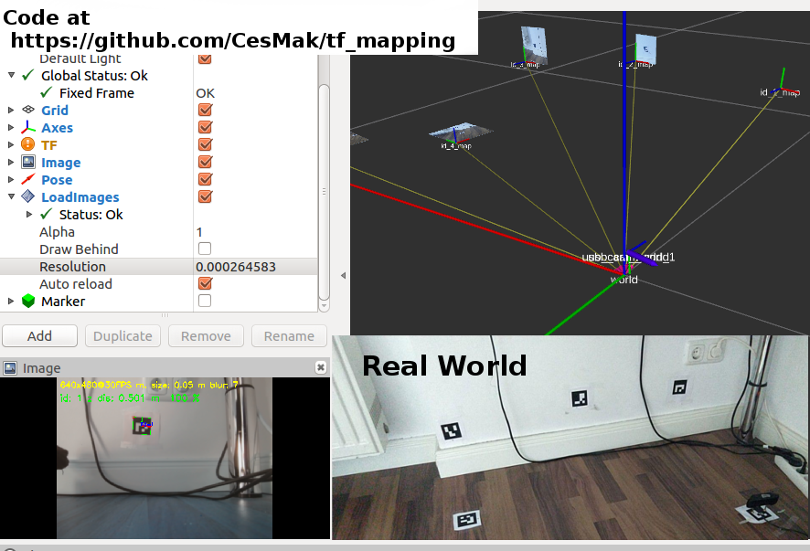

# tf_mapping

## Overview

This package extends [aruco_mapping](http://wiki.ros.org/aruco_mapping) with many features. You can use it to first create a map of aruco markers and then to navigate a simple camera (without depth information) in this map. 

**Author: Markus Lamprecht<br />
Maintainer: Markus Lamprecht, 2f4yor@gmail.com<br />**

Video:

<a alt="aruco_detector_example" href="https://www.youtube.com/watch?v=1jss-v16y4w"></a>

## Installation

### Dependencies

This software is built on the Robotic Operating System ([ROS]), which needs to be [installed](http://wiki.ros.org) first. Additionally, this package depends on following software:

- [alfons_msgs]
- [aruco_detector_ocv]
- [simple_kf]
- [rviz_pics]
- opencv

Install the above packages first!

### Building

In order to install this package, clone the latest version from this repository into your catkin workspace and compile the package using [catkin_tools](https://catkin-tools.readthedocs.io/en/latest/) :

``` 
mkdir -p catkin_ws/src
cd catkin_ws/src/
git clone git@github.com:CesMak/tf_mapping.git 
cd ..
catkin init 
catkin build
source devel/setup.bash
```

## Basic Usage

1. First step is to create a map:
    ``` 
        roslaunch tf_mapping start_tf_mapping.launch
    ``` 
    Store the tf's and the images using:
    ``` 
        rosrun tf_mapping tf_create_map.py
    ``` 
    - Adjust full_hd resolution (or the highes resolution for creating the map) in **tf_mapping/launch/start_tf_mapping.launch**
    - Point the camera such that only the aruco marker with id=0 is detected (This will be your initial coordinate system).
    - The transformations of all other detected aruco markers will be relative to this initial system.
    - Point the camera to another aruco marker e.g. with id=1
    - When moving the camera consider that always 2 markers are visible on every image.

2. Navigate your camera now in this map
    - Adjust to use now lower resolution e.g. 640x480 (to be realtime capable) in **tf_mapping/launch/start_tf_navigate.launch**
    ``` 
        roslaunch tf_mapping start_tf_navigate.launch
    ``` 

## Main Launch file
``` 
roslaunch tf_mapping start_tf_navigate.launch
``` 

## License BSD
If you want to use this package please contact: [me](https://simact.de/about_me).


## TODO's
- create map with high resolution images!
- http://wiki.ros.org/navigation

<!-- http://docs.ros.org/melodic/api/robot_localization/html/index.html#
http://docs.ros.org/melodic/api/robot_localization/html/migrating_from_robot_pose_ekf.html
https://vimeo.com/142624091
https://www.youtube.com/watch?v=nQZeAafDEJE
https://github.com/cra-ros-pkg/robot_localization 

// rostopic echo /scan |grep frame_id
// rosrun tf tf_monitor /marker_globe_1 /marker_globe_2
// rosrun tf tf_echo /marker_globe_1 /marker_globe_2

 -->


[ROS]: http://www.ros.org
[rviz]: http://wiki.ros.org/rviz
[grid_map_msg/GridMap]: https://github.com/anybotics/grid_map/blob/master/grid_map_msg/msg/GridMap.msg
[sensor_msgs/PointCloud2]: http://docs.ros.org/api/sensor_msgs/html/msg/PointCloud2.html
[geometry_msgs/PoseWithCovarianceStamped]: http://docs.ros.org/api/geometry_msgs/html/msg/PoseWithCovarianceStamped.html
[tf/tfMessage]: http://docs.ros.org/kinetic/api/tf/html/msg/tfMessage.html
[std_srvs/Empty]: http://docs.ros.org/api/std_srvs/html/srv/Empty.html
[grid_map_msg/GetGridMap]: https://github.com/anybotics/grid_map/blob/master/grid_map_msg/srv/GetGridMap.srv
[grid_map_msgs/ProcessFile]: https://github.com/ANYbotics/grid_map/blob/master/grid_map_msgs/srv/ProcessFile.srv
[alfons_msgs/KfState]: https://github.com/CesMak/alfons_msgs/blob/master/msg/KfState.msg
[alfons_msgs]: https://github.com/CesMak/alfons_msgs
[aruco_detector_ocv]: https://github.com/CesMak/aruco_detector_ocv
[simple_kf]: https://github.com/CesMak/simple_kf
[rviz_pics]: https://github.com/CesMak/rviz_pics